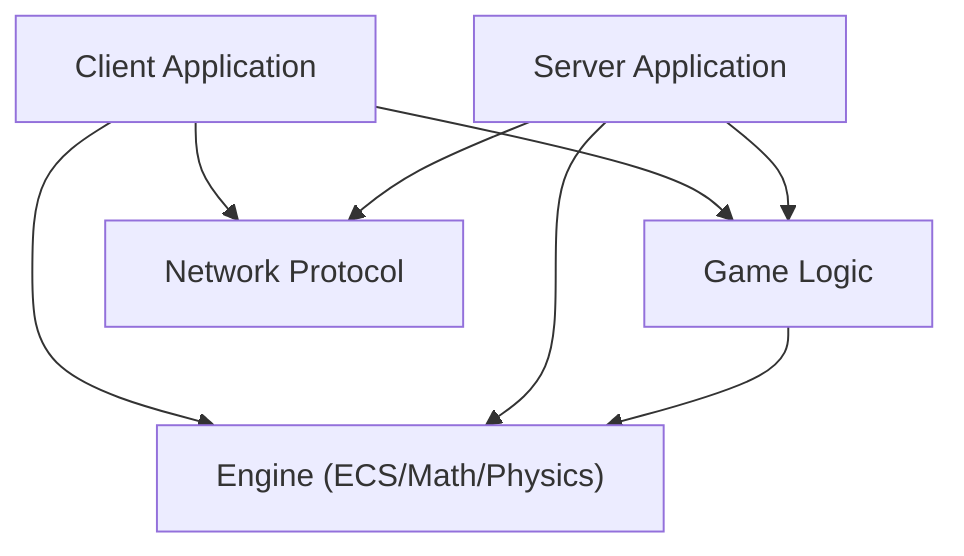

# R-Type Architecture Documentation

> **Technical Reference** - *Last Updated: December 2025*

This document provides a comprehensive technical breakdown of the R-Type project. It is structured around the **5 Core
Pillars** of the architecture: **Engine**, **Protocol**, **Game Logic**, **Server**, and **Client**.

---

## 1. High-Level Architecture

The project is built as a **multi-layer application** where a common engine supports both a headless server and a
graphical client.



- **Engine**: Reusable framework (ECS, Render, Network IO).
- **Protocol**: Shared binary specification (Packets, Serialization).
- **Game Logic**: R-Type specific rules (Entities, Systems).
- **Server**: Authoritative simulation loop.
- **Client**: Presentation layer (Input, Audio, Rendering).

---

## 2. Pillar I: The Engine (Framework)

The Engine provides the raw technology to build the game but contains **no gameplay rules**.

### 2.1 Entity Component System (ECS)

A custom, high-performance data-oriented system.

- **Sparse Arrays (`SparseArray<T>`)**: Components are stored in vectors of `std::optional<T>`. This allows $O(1)$
  access by Entity ID while maintaining cache locality for packed data strategies.
- **The Zipper (`ZipperIterator`)**: A template-meta-programming iterator that locks multiple component arrays together.
  It allows systems to iterate *only* entities that possess all required components.
  ```cpp
  // Zero runtime overhead filtering
  for (auto&& [pos, vel] : Zipper(positions, velocities)) {
      pos->x += vel->vx * dt;
  }
  ```

### 2.2 Network Transport

- **Socket Abstraction**: Wraps OS-level UDP sockets (via `asio`).
- **PacketBuffer**: An endian-aware binary writer/reader. It handles Big-Endian conversion automatically, ensuring the
  game works across different CPU architectures (e.g., x86 Server vs ARM Client).

### 2.3 Resource Management

- **Assets**: Textures, Fonts, and Sounds are loaded once and reference-counted via `std::shared_ptr`.
- **Hot-Reloading**: The resource manager can reload assets on the fly if files change on disk (Debug mode only).

---

## 3. Pillar II: The Protocol (Communication)

The Protocol defines the "language" spoken between Client and Server. It is designed for **low bandwidth** and *
*real-time** performance.

### 3.1 Binary Packet Format

Every UDP datagram follows this strict byte layout:

| Offset | Field       | Type     | Description                               |
|--------|-------------|----------|-------------------------------------------|
| 0x00   | `version`   | `uint16` | Protocol version check.                   |
| 0x02   | `msg_type`  | `uint8`  | ID (e.g., `InputState`, `WorldSnapshot`). |
| 0x03   | `flags`     | `uint8`  | `Reliable` (0x1), `Compressed` (0x2).     |
| 0x04   | `sequence`  | `uint32` | Packet ID (Monotonic).                    |
| 0x08   | `ack`       | `uint32` | Last packet received from peer.           |
| 0x0C   | `ack_bits`  | `uint32` | Bitmask of last 32 packets received.      |
| 0x10   | `timestamp` | `uint32` | Milliseconds (for RTT calc).              |
| 0x14   | `payload`   | `var`    | Type-specific serialized data.            |

### 3.2 Reliability Layer

UDP is unreliable. We implement a custom ARQ (Automatic Repeat Request) system:

- **ACKs**: Every packet header carries acknowledgement for previous packets.
- **Resend Queue**: Sent packets marked "Reliable" (e.g., `PlayerDied`, `JoinRequest`) are stored. If they aren't ACKed
  within `250ms`, they are re-sent.
- **Unreliable Data**: Position updates don't need reliability; newer snapshots inherently obsolete older ones.

---

## 4. Pillar III: Game Logic (Rules)

This module defines "What is R-Type". It uses the Engine to implement gameplay.

### 4.1 Entities

Defined in `config/` JSON files and constructed via Builders (`PlayerBuilder`, `EnemyBuilder`).

- **Player**: `Position`, `Velocity`, `Health`, `Weapon`, `Input`.
- **Enemy**: `Position`, `AI`, `ScoreValue`, `Hitbox`.

### 4.2 Systems

Logic is split into single-responsibility Systems:

- **`PlayerInputSystem`**: Translates `InputState` packets into Entity Velocity.
- **`MovementSystem`**: Applies Velocity to Position using Fixed Delta Time.
- **`CollisionSystem`**: Uses a QuadTree (or BoundingBox checks) to detect overlaps. Resolves logic: Bullet hits
  Enemy -> Damage.
- **`WaveSystem`**: Monitors `active_enemy_count`. If low, spawns the next wave pattern from `levels/level1.json`.

---

## 5. Pillar IV: The Server (Simulation)

The Server is the **Authoritative Source of Truth**. It runs `GameLogic` and broadcasts the results.

### 5.1 The Game Loop

The server uses a **Fixed Timestep Accumulator** loop for deterministic physics.

```cpp
while (running) {
    accumulator += timer.Delta();
    while (accumulator >= 1/60.0f) {
        Network.Poll();
        Game.Update(1/60.0f); // Logic Step
        Snapshot.Broadcast(); // Serialize World
        accumulator -= 1/60.0f;
    }
    Sleep(); // Yield CPU
}
```

### 5.2 World Snapshots

- **Delta Compression**: The server doesn't send the full world every frame. It calculates what changed (Delta) since
  the last acknowledged snapshot.
- **Serialized Fields**: Only relevant data is sent (e.g., Enemy X/Y changed? Send. Enemy HP constant? Don't send).

---

## 6. Pillar V: The Client (View)

The Client is a "Dumb Terminal" that renders what the server says, but predicts inputs to feel responsive.

### 6.1 State Reconciliation

1. **Input Prediction**: When the user presses "Right", the client immediately moves the local sprite.
2. **Server Correction**: When the Server Snapshot arrives, the client compares the *authoritative* position with its
   *predicted* position.
    - **Correction**: If the error is large (latency/packet loss), the client snaps to the server position (
      Rubber-banding).

### 6.2 Render Pipeline

1. `WorldUpdateReceiver` applies the Snapshot to the client's local ECS `Registry`.
2. `InterpolationSystem` smoothes movement between two network snapshots to prevent "jittery" 20Hz updates from looking
   bad at 60Hz.
3. `RenderSystem` iterates `SpriteComponent`s and draws them via Raylib.

---

## 7. Interaction Flow: "The Life of a Packet"

To illustrate how these pillars interact, let's trace the **Firing** mechanics.

1. **Input (Client)**: User presses `SPACE`. `InputSender` sets `shoot = true` in the `InputState` payload.
2. **Transport (Client)**: `NetworkTransport` serializes the packet (Seq #101) and sends UDP bytes.
3. **Reception (Server)**: `ServerRuntime` receives bytes, deserializes to `InputState`, maps IP to `PlayerID=1`.
4. **Logic (Server)**: `GameInstance` runs `PlayerInputSystem`.
    - Reads `InputState`. Sees `shoot == true`.
    - Calls `EntityFactory::CreateMissile(PlayerPos)`.
    - New Entity ID `500` created with `Velocity{10, 0}`.
5. **Simulation (Server)**: `MovementSystem` moves Entity 500. `CollisionSystem` checks hits.
6. **Snapshot (Server)**: `BroadcastWorldSnapshots` sees a new Entity `500`. Encodes `CreateEntity` op into the packet.
7. **Reception (Client)**: `WorldUpdateReceiver` decodes snapshot. Calls `Registry.CreateEntity(500)`.
8. **Render (Client)**: `RenderSystem` sees Entity 500 has a `Sprite`. Draws the missile texture.

---

This breakdown covers the full vertical slice of the R-Type architecture. For API-level details, refer to the Doxygen
comments in the headers.
